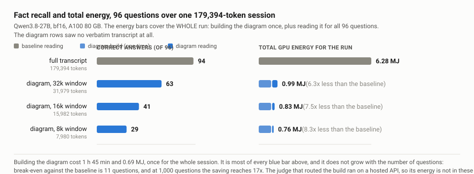

# HAMIB — Hierarchical Additive Mass-Injection Bias

A retrain-free attention-layer intervention for long-conversation recall. HAMIB
compresses a conversation into a hierarchical *correlation diagram* and injects
per-topic mass into the attention logits, with no fine-tuning.

Source-available under PolyForm Noncommercial 1.0.0 — commercial use requires a
separate licence ([details](#license)). Patent pending.

## Latest measurement — 2026-09, Qwen3.8-27B on A100 80&nbsp;GB



A reader shown **only** a 32,000-token correlation diagram — not one line of the
original transcript — recovered **56 of 88 facts** from a 179,394-token agent
session, including exact values from four hours earlier. Counting the one-time
cost of building the diagram, the whole 96-question run took **0.991 MJ against
6.282 MJ**: **6.3x less energy for 67% of the answers**. It passes break-even at
11 questions and approaches 21x as the build amortizes.

| | correct | prompt tokens | total FLOPs | wall | GPU energy |
|---|---|---|---|---|---|
| full transcript | **94**/96 | 179,394 | 1.60e16 | 220.1 s | 65,435 J |
| diagram, 32k window | **63**/96 | 31,979 | 1.93e15 | 10.9 s | 3,108 J |
| diagram, 16k window | 41/96 | 15,982 | 9.13e14 | 5.2 s | 1,442 J |
| diagram, 8k window | 29/96 | 7,980 | 4.43e14 | 2.6 s | 667 J |

Accuracy across the full grid, by window size and bias strength `w`:

| window | w = 0 | w = 0.1 | w = 0.3 | w = 1.0 |
|---|---|---|---|---|
| 32,000 | **63** | **63** | 58 | 27 |
| 16,000 | 41 | 41 | 33 | 20 |
| 8,000 | 29 | 29 | 24 | 18 |

**Two things this run does not show.** It does not show parity: the full
transcript wins every cell (McNemar one-sided p &lt; 1e-9). And the attention bias
contributed nothing — `w = 0` and `w = 0.1` produced byte-identical answers at
all three window sizes, and larger `w` only made things worse. Everything the
diagram rows achieved came from narrowing the context, not from the bias. The
[full write-up](#the-2026-09-run-in-detail) gives the failure
analysis and the two configuration defects behind the bias result.

The external judge that routed the manager's decisions is a hosted API, so its
energy is not measurable here. What is measured is published: 10,571 requests,
42.2M input and 9.8M output tokens, 1.77 USD.

Raw logs, per-question records and the scorer are in `benchmark/mcbuild_bench/`.

The architecture, the data structure and the mass-aware attention formula are set
out in:

> Kawai, R. (2026). *Geometric Convergence for Conversational Context
> Management: A Distributed Structured Memory Architecture Based on
> Correlation-Diagram Data.* Zenodo. <https://doi.org/10.5281/zenodo.19354705>

---

## What it does

1. **Correlation Diagram (CD).** Dialogue is parsed into a three-tier graph:
   - **sun** nodes — top-level topics / titles
   - **planet** nodes — distinct facts or threads under a sun
   - **satellite** nodes — concrete details under a planet

2. **Mass-aware attention.** Each planet node is assigned a *mass* equal to
   the number of satellites attached to it (how much a topic was elaborated on).
   That mass is added to the pre-softmax attention logits:

   ```
   Attention(Q, K, V) = Softmax(QK^T / sqrt(d_k) + w * M) V
   ```

   where `M` is the mass matrix and `w` a scalar weight. Because the term is
   *additive and applied before softmax*, it works as a lightweight patch on any
   existing Transformer — **no retraining required**.

This is the distinguishing point from retrieval-based memory (which sits outside
the LLM) and from learned memory layers (which require training): HAMIB modifies
attention at inference time only.

---

## Architecture: server / management split

The system has two conceptually independent halves:

- **Inference side (`server/`)** — the model wrapper that monkey-patches
  `scaled_dot_product_attention` to inject mass into the attention logits.
  This is the part that needs a GPU.
- **Management side (`management/` + `evaluation/` + `models/` + `store/`)** —
  the bookkeeping that builds the correlation diagram from dialogue turns and
  decides what gets mass. This is plain Python that runs anywhere.

Keeping them in the same repository is a convenience for the prototype, not a
design constraint. The boundary between the two halves is the HTTP API in
`server/main.py` (`/chat`, `/chat_baseline`, `/extract_nodes`). A deployment
could run `server/` as a GPU service and the management side as a separate
client process; `communication/controller.py` is a (currently unwired)
reference implementation of that client.

For local benchmarking we collapse the split into a single in-process class,
`server/hamib_session.py:HAMIBSession`, which runs the same flow without a network
hop. That is the path the experiments use.

---

## Repository structure

```
hamib/
├── README.md
├── NOTICE.md                        # third-party attribution
├── LICENSE                          # PolyForm Noncommercial 1.0.0
├── ruff.toml                        # lint configuration
├── config.yaml                      # model id, mass weights, thresholds
├── requirements.txt
│
├── server/                          # Inference-side: mass injection into attention
│   ├── mass_weighted_gemma.py       # main: MassWeightedLLM, patches scaled_dot_product_attention with scores += w*M
│   ├── mass_weighted_{gptoss,gemma4,gemma3n,qwen,llama}.py   # per-model variants
│   ├── m_matrix_builder.py          # builds the M matrix (column = attended-to token)
│   ├── cd_parser.py                 # parses node list / locates [PN{mass}] token positions
│   ├── sbert_extractor.py           # SBERT + regex concept extractor
│   ├── hamib_session.py             # self-contained session: management + evaluation + inference
│   └── main.py                      # FastAPI server (/chat, /chat_baseline, /extract_nodes)
│
├── management/                      # Client-side: builds and merges the CD
│   ├── text_chunker.py              # splits dialogue into semantic minimal units
│   ├── node_classifier.py           # scores chunks on 3 axes -> sun / planet / satellite
│   ├── graph_merger.py              # merges a provisional CD into the existing CD
│   └── graph_builder.py             # applies node proposals to a CD
│
├── models/                          # CD data structures
│   ├── correlation_diagram.py       # CorrelationDiagram -> Sun -> Planet -> satellites
│   └── node.py                      # node levels, coordinates, mass
│
├── evaluation/                      # Consistency-maintenance unit (disabled by default)
│   ├── scorer.py / scorer_llm.py / replacer.py / eval_graph_builder.py
│
├── communication/  store/  utils/   # CD serialization, persistence, similarity helpers
│
├── benchmark/                       # Simple built-in recall benchmark
│   ├── runner.py / plotter.py / run_benchmark.py / dataset.py
│
├── experiments/                     # Benchmark drivers + LLM-judge evaluation
│   ├── bench_scaler.py              # synthetic difficulty-scaling benchmark + energy logging
│   ├── bench_gptoss20b_3way.py      # GPT-OSS-20B 3-way (vanilla / hamib_sbert / hamib)
│   ├── bench_longmemeval.py         # LongMemEval (haystack QA)
│   ├── bench_energy_monitor.py      # GPU/CPU/RAM time-series sampler
│   ├── dialogue_extractor.py        # regex-only CD extractor for natural dialogue (<1 ms/turn)
│   └── judges/                      # blinded LLM-judge protocol (see below)
│
├── benchmark/
│   ├── mcbuild_bench/               # 2026-09 Qwen3.8-27B run — the headline result
│   │   ├── DESIGN.md                # the frozen contract for the run
│   │   ├── DECISIONS.md             # decision ledger; every deviation and its reason
│   │   ├── data/                    # redacted corpus, 96 questions, fact ledger
│   │   ├── build_cd.py              # manager phase: builds the diagram over the session
│   │   ├── run_arms.py              # reader phase: one cell = one (arm, W, w)
│   │   ├── windows.py               # budgeted window composition (diagram + round trips)
│   │   ├── score_cells.py           # paired scoring: McNemar + bootstrap + compute ratios
│   │   ├── jev_judge.py / jev_client.py / summarizer_client.py
│   │   ├── gpu_sampler.py           # 1 Hz power sampling and per-span energy
│   │   ├── pod/                     # the scripts as they ran on the GPU host
│   │   └── results/a100_2026-09-20/ # 159 raw files with checksums; see its README
│   ├── bineval/                     # binary-decomposition question instrument
│   └── longchat/                    # long synthetic dialogue corpora
│
├── tests/                           # 890 tests (pytest); none require a GPU
│
└── results/                         # Raw outputs of the 2026-05 experiments
    ├── oom_rescue/                  # GPT-OSS-20B OOM-rescue data
    ├── latency/                     # latency benchmark (A100, Llama 70B)
    └── longmemeval/                 # LongMemEval raw model outputs (HAMIB vs baseline)
```

---

## The 2026-09 run in detail

The detail behind the summary at the top of this file. This is the first run that
separates the two halves of the design: does the attention bias contribute
anything, or does the benefit come entirely from narrowing the context onto the
correlation diagram?

The corpus is a real 4-hour agent development session (179,394 reader tokens,
36 round trips, redacted and published as
`benchmark/mcbuild_bench/data/session_redacted.json`) and 96 questions written
against it (88 facts + 8 whose answer is deliberately absent from the corpus).
Two arms, same model, same prompt, greedy decoding:

- **full transcript** — `Qwen/Qwen3.8-27B` (bf16, no quantization) reads all
  179,394 tokens for every question;
- **proposed** — a correlation diagram is built once over the session, and the
  reader sees only a budgeted window of it (8,000 / 16,000 / 32,000 tokens) with
  the mass bias applied to planet lines at strength `w`.

### Accuracy (questions answered correctly, out of 96)

| window | w = 0 (no bias) | w = 0.1 | w = 0.3 | w = 1.0 |
|---|---|---|---|---|
| 8,000 | 29 | 29 | 24 | 18 |
| 16,000 | 41 | 41 | 33 | 20 |
| 32,000 | **63** | **63** | 58 | 27 |
| full transcript (179,394) | **94** | | | |

### Compute, measured per question

GPU energy is the integral of `nvidia-smi` `power.draw` sampled at 1 Hz over each
question's span (`benchmark/mcbuild_bench/gpu_sampler.py`); the raw CSVs are
published. `attention FLOPs` counts the QK^T term of the 16 full-attention
layers; `total FLOPs` adds the linear-layer term `2 * 27e9 * prompt_tokens` that
all 64 layers pay.

| arm | correct | prompt tokens | attention FLOPs | total FLOPs | wall | GPU energy |
|---|---|---|---|---|---|---|
| full transcript | 94/96 | 179,394 | 6.33e15 | 1.60e16 | 220.1 s | 65,435 J |
| W=32,000, w=0.1 | 63/96 | 31,979 | 2.01e14 | 1.93e15 | 10.9 s | 3,108 J |
| W=16,000, w=0.1 | 41/96 | 15,982 | 5.02e13 | 9.13e14 | 5.2 s | 1,442 J |
| W=8,000, w=0.1 | 29/96 | 7,980 | 1.25e13 | 4.43e14 | 2.6 s | 667 J |

Building the diagram is a one-time cost: 1 h 45 min of wall time and 0.694 MJ of
GPU energy (integrated the same way), producing 1,606 nodes from 3,388 chunks.
Over the 96 questions the totals are 6.282 MJ for the full transcript against
0.991 MJ for the proposed side including the diagram build, a **6.3x reduction**.
It passes break-even at 11 questions and approaches 21x as the build amortizes
(17x at 1,000 questions).

### What this does and does not show

It does not show parity. The full transcript wins every cell (McNemar
one-sided p < 1e-9 in that direction; 95% CI of the pass-rate difference for the
best cell [-0.42, -0.23]). The best cell keeps 67% of the answers for 12% of the
total FLOPs. "Equal recall at lower compute" is **not** demonstrated by this run.

The attention bias contributed nothing here. `w = 0` and `w = 0.1` are
indistinguishable at all three window sizes — zero questions gained, zero lost,
and the generated answer string is byte-identical on 96/96, 95/96 and 94/96
questions respectively. Above 0.1 the bias is purely harmful. The cause is visible in the data, and it is a property of this configuration
rather than a refutation of the mechanism: the added term is `w * mass` where `mass` is the raw satellite
count, un-normalized and uncapped (0-43, median 1, **41% of planets are 0**), so
`w = 0.1` adds +0.10 to the median planet while `w = 1.0` adds +43 to the largest.
That is e^43 on a pre-softmax logit, and it collapses the output. There is also a targeting problem: 74 of the 88 fact questions have their answer
in a satellite node and only 3 in a planet node, while the bias is applied to
planets only (`--inject planet`). The `planet+satellites` inheritance switch
exists in `server/cd_parser.py` and was never exercised.

What the diagram itself achieved is the more interesting half. In every cell the
window held the diagram alone: `n_recent_rts` is 0, so not one verbatim round
trip was ever shown to the reader. All 56 recovered facts — including exact values from four
hours earlier such as `4440`, `1/110`, `2:1` and `4035`, came from the diagram. Of the 30 facts the full transcript got and the best cell
missed, only 1 was evicted by the window budget and 4 were never in the diagram.
The other 25 were present in the window and the reader did not use them. The
bottleneck is extraction from a dense field of terse summaries, not
information loss in the manager.

Behaviour on unanswerable questions is sound. The 8 questions with no answer in
the corpus were answered "unknown" correctly 8/8 at W=8,000 and W=16,000, and 7/8 at
W=32,000. Narrowing the window does not induce fabrication.

### The external judge

The manager's routing decisions were made by **TypeSafe Jev**, a hosted API and the
only external call in the experiment. Its own energy is therefore not measurable
here; what is measured is published instead: 10,571 requests, 42.2M input and 9.8M
output tokens, 1.77 USD, and 0 unparsed, 0 defaulted, 0 retries. Every request
and its answer is in
`benchmark/mcbuild_bench/results/a100_2026-09-20/raw/v4_36rt/jev_calls.*.jsonl.gz`.
A bound is more useful than a guess. To erase the 6.3x saving, the judge's side
would have to sustain more than 1,523 W, roughly four 400 W GPUs, for the 58
minutes it was working. At one such GPU the saving is 2.6x, at two it is 1.7x.

### Reproducing it

```bash
# score the published run (no GPU needed)
python -m benchmark.mcbuild_bench.score_cells \
  --main benchmark/mcbuild_bench/results/a100_2026-09-20/raw/main \
  --questions benchmark/mcbuild_bench/data/questions.json \
  --out scores.json --md scores.md
```

`benchmark/mcbuild_bench/DESIGN.md` is the contract, `DECISIONS.md` the decision
ledger (every deviation from the design is recorded there with its reason), and
`results/a100_2026-09-20/README.md` indexes the 159 raw files with their
checksums. The pod scripts under `benchmark/mcbuild_bench/pod/` are the ones that
actually ran.

> **Redaction.** The corpus is a real development session, published after
> redaction. The rule file that performed it is deliberately **not** in this
> repository, because the rules necessarily contain the original private values.
> `benchmark/mcbuild_bench/data/redaction_report.md` reports the counts by
> category.

---

## Earlier results (2026-05, Llama 3.3 70B / GPT-OSS-20B)

These predate the run above and are kept for the record. Read them together with
the finding that the bias contributed nothing in the 2026-09 configuration: the
numbers below are **joint effects of the correlation diagram and the bias**, and
the attribution between the two was never separated in these experiments. They
were also produced before the attention-path defects found in the 2026-09 code
review were fixed, so re-running the current code will not reproduce them
exactly.

All accuracy numbers below are from a **blinded, paired LLM-judge** evaluation
(see *Evaluation methodology*). "HAMIB" and "baseline" use the **same base LLM**;
the only difference is whether HAMIB attention modification is applied.

| Experiment | Setup | baseline | HAMIB | Result |
|---|---|---|---|---|
| **LongMemEval accuracy** | Llama 3.3 70B, N=500, paired | 0.234 | **0.306** | **1.308×** (Claude Opus 4.7 judge), McNemar p=0.0037, 95% CI of ratio [1.086, 1.587] |
| **OOM rescue** | GPT-OSS-20B on a 24GB GPU, N=25 | 0/25 (out of memory) | **22/25 (88%)** | runs a 20B model in 24GB by compressing context into the CD |
| **Latency** | Llama 3.3 70B, synthetic benchmark | p50 12.7s / p95 22.3s | **p50 5.6s / p95 6.2s** | **2.26× / 3.61×** faster (accuracy difference not significant here) |

### Judge-model robustness

The LongMemEval result reproduces across **two independent judge models**:

| | Claude Opus 4.7 | GPT-5 |
|---|---|---|
| ratio (HAMIB / baseline) | 1.308× | 1.314× |
| McNemar one-sided p | 0.0037 | 0.0016 |
| 95% CI of ratio | [1.086, 1.587] | [1.106, 1.575] |

Inter-judge agreement on the same 1000 items: **observed agreement 91.3%
(913/1000), Cohen's kappa 0.78** — both reproducible by running
`python -m experiments.judges.analyze_inter_judge_agreement` against the
bundled `judge_output_lme.json` files in both judge subdirectories. See
`experiments/judges/README.md` for details.

---

## Evaluation methodology

LLM-as-judge evaluations can be biased if the judge can infer which response came
from the system under test. To prevent this, the judge runs under a **blinded
protocol** (see `experiments/judges/README.md`):

- inputs strip all mode labels; HAMIB vs baseline identity is removed
- item order is shuffled with a fixed seed
- the de-anonymization key is kept private and is **not** in this repository
- the judge prompt forbids reading any other file and forbids speculating about
  what produced the responses

Aggregation uses a paired McNemar test plus a 10,000-iteration bootstrap
confidence interval (`experiments/judges/*/analyze_paired*.py`). The same
protocol was run with Claude Opus 4.7 and, independently, with GPT-5.

**On blinding vs. transparency.** The blinding above applies to the judge *at
evaluation time* — the de-anonymization key was withheld and the judge could not
tell HAMIB from baseline by item identity. For transparency, this repository also
publishes the raw per-item model outputs in `results/longmemeval/`. As a result,
a reader can match the `qid` in a `judge_input` file against those raw outputs
to recover which response was HAMIB and which was baseline. That post-hoc recovery
is by design (we publish the raw data so results can be re-aggregated); it does
not affect the blinding that was in force when the judge produced its labels.

**Known caveat (transparent disclosure).** In **1.40%** of LongMemEval items
(14 of 1000) the Llama 3.3 70B model echoed HAMIB-specific input scaffolding
tokens (`[PN1.0]`, `[PN0.5]`, `<CONTEXT>`) into its own response text, which
would let an attentive judge identify HAMIB items by their response alone.
Re-aggregating with these items excluded leaves the ratio direction unchanged.
A bundled check script,
`python -m experiments.judges.check_input_markers`, lists the affected
`anonymous_id`s so a reader can verify the count independently, and the
preparation script `prepare_lme_v10_blinded.py` now asserts that no such
markers appear in future runs. The published `judge_output_*.json` reflect
judging the original (un-sanitized) inputs; the published numbers are reported
as-is rather than re-judged silently.

---

## How to read the experiment data

| Path | Format / role | Supports which result | Data origin & license |
|---|---|---|---|
| `results/longmemeval/longmemeval_baseline.json` | Llama 3.3 70B raw outputs, 500 LongMemEval questions, HAMIB OFF | LongMemEval accuracy result (1.308×) | Questions and gold derive from LongMemEval (MIT, © 2024 Di Wu). Outputs are ours, under PolyForm-NC. See `NOTICE.md`. |
| `results/longmemeval/longmemeval_hamib_sbert.json` | Same 500 questions, HAMIB ON | LongMemEval accuracy result (1.308×) | same as above |
| `results/oom_rescue/exp_gptoss_3way_N25.json` | GPT-OSS-20B 3-way (vanilla / HAMIB-SBERT / HAMIB) on a 24 GB GPU, N=25 facts | OOM-rescue result (0/25 → 22/25) | PolyForm-NC (no external dataset) |
| `results/oom_rescue/bench_gptoss_L2.log` | Verbatim CUDA-OOM trace for the vanilla run above | OOM-rescue result (evidence) | PolyForm-NC |
| `results/latency/exp_scaler_N200_l5adv.json` | Llama 3.3 70B latency benchmark, N=200 distractor scenario | Latency result (p50 2.26× / p95 3.61×) | PolyForm-NC |
| `experiments/judges/v10_paired_2026_05_21/` | Claude Opus 4.7 blinded judge: paired LongMemEval inputs (`judge_input_lme.json`), raw judgments (`judge_output_lme.json`), aggregated report (`report_lme_v10_paired.md`) | LongMemEval accuracy | Code is ours under PolyForm-NC. LongMemEval items derive from LongMemEval (MIT). See `NOTICE.md`. |
| `experiments/judges/codex_gpt5_2026_05_25/` | GPT-5 blinded judge: same protocol, independent re-judging | Judge-model robustness | same as above |

Each `report_*.md` is the quickest way to see the headline numbers. The
`judge_input_*.json` / `judge_output_*.json` pairs let you re-aggregate from
the raw judgments using the included `analyze_paired*.py` scripts.

---

## Setup

### Prerequisites

- Python 3.11+
- A CUDA-capable GPU is required to run the default model
  (`google/gemma-3-4b-it`, configured in `config.yaml`). The headline benchmark
  models — `meta-llama/Llama-3.3-70B-Instruct` and `openai/gpt-oss-20b` — are
  larger still; see each `experiments/bench_*.py` for the specific model id it
  loads.
- Several of these models are **gated on Hugging Face** (Gemma, Llama). Before
  the first run you need to accept the model card terms and authenticate:
  ```bash
  huggingface-cli login
  ```
  Then visit the model page in a browser (e.g.
  https://huggingface.co/google/gemma-3-4b-it) and click "Agree and access".
- CUDA-enabled PyTorch is required because `config.yaml` defaults to
  `device: cuda` with `quantization: nf4` (bitsandbytes). The default
  `pip install torch` on Windows installs a CPU-only build, which will fail to
  load these models. Install the CUDA build from the appropriate index, e.g.:
  ```bash
  pip install torch --index-url https://download.pytorch.org/whl/cu121
  ```
  To run on CPU instead (much slower; the largest models will not fit), set
  `device: cpu` and remove the `quantization: nf4` line from `config.yaml`.

### Install

```bash
pip install -r requirements.txt
```

### Run the FastAPI inference server

```bash
python -m server.main
```

The server will load the model in `config.yaml` (default `google/gemma-3-4b-it`)
at startup, so the first launch waits on the Hugging Face download.

### Run the built-in recall benchmark

```bash
python -m benchmark.run_benchmark
```

Key settings (model id, `mass_weight` `w`, node-mass defaults, thresholds) are
in `config.yaml`.

---

## A note on language

Code comments and documentation are in English. Some **functional data** is
intentionally kept in Japanese, because the prototype was developed and
evaluated on Japanese conversations and these strings directly steer LLM
behavior:

- LLM prompts: node extraction (`server/cd_parser.py`), the default chat
  prompt and similarity-judgment prompt (`server/hamib_session.py`),
  internal-evaluation judgment prompts (`evaluation/scorer_llm.py`)
- the connective list used to segment dialogue (`management/text_chunker.py`)
- query-detection substrings (`_QUERY_PHRASES` in `server/hamib_session.py`)
- SBERT query phrases (`server/sbert_extractor.py`)
- synthetic conversation templates in the scaling benchmark
  (`experiments/bench_scaler.py`)

**Why these are kept in Japanese.** Prompt wording directly steers an LLM's
output distribution: paraphrasing a prompt — even by a competent translator or
another LLM — measurably shifts the model's extraction structure, similarity
scores, and final answers. Substituting a translated prompt for the original
would therefore change *the system being measured*, and the headline numbers
in `results/` and `experiments/judges/` would no longer be reproducible from
this code. The Japanese originals are kept as the active strings so the
published results can be re-run as-is. Prompt language is treated as a
controlled variable of the experiment.

**For reading.** An English translation of each Japanese prompt is provided
as a comment block immediately above the live string in the source. The
English text is reference-only; the LLM still sees the Japanese.

The benchmark input (LongMemEval) and the judge prompts under
`experiments/judges/` are English and are unaffected by this policy.

---

## License

**Code** in this repository: PolyForm Noncommercial 1.0.0 (see `LICENSE`). Free
for research, evaluation, and other noncommercial use with attribution.
**Commercial use requires a separate license.** Patent pending.

This is a **source-available** research release. PolyForm Noncommercial 1.0.0
is not an OSI-approved open source license, so this repository is not "open
source" in the OSI sense — see PolyForm Project's
[introduction](https://polyformproject.org/about/) for the design rationale of
source-available licenses.

**Bundled benchmark data** is governed by its own upstream license, not by the
code license (see `NOTICE.md` for full text and attribution):

- LongMemEval data (`results/longmemeval/`, `*_lme*` judge files): MIT,
  © 2024 Di Wu

## Citation

If you use this work, please cite the theoretical paper:

```bibtex
@misc{kawai2026hamib,
  title     = {Geometric Convergence for Conversational Context Management:
               A Distributed Structured Memory Architecture Based on
               Correlation-Diagram Data},
  author    = {Kawai, Ryosuke},
  year      = {2026},
  doi       = {10.5281/zenodo.19354705},
  url       = {https://doi.org/10.5281/zenodo.19354705},
  publisher = {Zenodo}
}
```

If you use the bundled benchmark data, also cite the original work (BibTeX in
`NOTICE.md`): LongMemEval (Wu et al., ICLR 2025).

## Contact

Author: **Ryosuke Kawai** — independent researcher

For commercial licensing, access to additional implementation details, or
research collaboration:

- Email: ryosukekawai1224@gmail.com
- X (DMs open): [@rkcevE](https://x.com/rkcevE)
